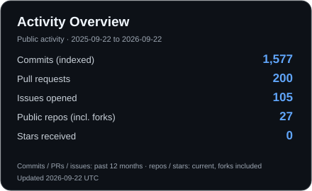
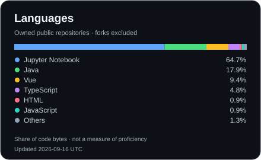

    
    

    
 
    <h2 style="border-bottom: 1px solid #d8dee4; color: #282d33;"> 😎 Introduction </h2>  
    
 
        지식과 함께 성장하는 개발자 김도윤입니다. 🌳  
        성능 개선을 통한 사용자 경험 개선, AI 기술 적용에 관심이 있습니다.
    
 
    

    

  <h2>🛠️ Tech Stacks</h2>

  <h3>💻 Programming Languages</h3>
  

    
    
    
  

  <h3>🍃 Backend Frameworks</h3>
  

    
    
    
  

  <h3>🎨 Frontend Frameworks</h3>
  

    
    
  

  <h3>🗄️ Databases</h3>
  

    
    
    
    
  

  <h3>🤖 AI / Automation</h3>
  

    
    
    
    
    
  

  <h3>☁️ Infrastructures</h3>
  

    
    
    
  

  <h3>🧪 Testing / Monitoring</h3>
  

    
    
    
    
    
  

  <h3>🔄 CI/CD</h3>
  

    
  

  <h3>🤝 Collab Tools</h3>
  

    
    
    
    
  

  <h3>🧑‍💻 IDE</h3>
  

    
    
    
  

  <h3>🧰 Others</h3>
  

    
    
  

  

    

    <h2 style="border-bottom: 1px solid #d8dee4; color: #282d33;"> 🧑‍💻 Contact me </h2>   
    
 
         
         
          
    
    
  
 
    

    
 
    <h2 style="border-bottom: 1px solid #d8dee4; color: #282d33;"> 🏅 Stats </h2> 
  
       
 
    

